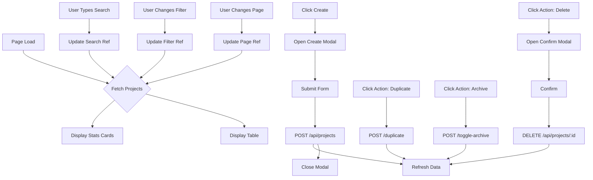

# Technical Design: Projects Page (`app/pages/app/projects/index.vue`)

## Overview
This document outlines the technical implementation for the Projects listing page. The page will display a paginated, sortable, and filterable list of projects, along with summary statistics. It will use Nuxt UI components and interact with the existing `/api/projects` endpoints.

## 1. API Integration

### Endpoints
-   `GET /api/projects`: Fetches project list and stats.
    -   **Query Params**:
        -   `q`: Search term (string)
        -   `status`: Filter by status ('active', 'draft', 'archived', or empty for all)
        -   `has_repo`: 'true' | 'false' (optional)
        -   `has_vercel`: 'true' | 'false' (optional)
        -   `sort`: Sort string (e.g., 'updated_at desc')
        -   `page`: Page number (number)
        -   `pageSize`: Items per page (number)
    -   **Response**:
        ```typescript
        {
          data: Project[],
          count: number, // Total records for current filter
          counts: {      // Global stats
            total: number,
            active: number,
            draft: number,
            archived: number
          }
        }
        ```
-   `POST /api/projects`: Create a new project.
-   `DELETE /api/projects/:id`: Delete a project.
-   `POST /api/projects/:id/duplicate`: Duplicate a project.
-   `POST /api/projects/:id/toggle-archive`: Archive/Unarchive.

### Types
Ref: `app/types/projects.ts`
```typescript
interface Project {
  id: string
  name: string
  description: string | null
  status: 'draft' | 'active' | 'archived'
  repo: string | null
  vercel_id: string | null
  updated_at: string
  // ... other fields
}
```

## 2. Component Structure

### Layout
Standard Dashboard Layout:
1.  **Header**:
    -   Title: "Projects"
    -   Action: "Create Project" button (Opens Modal)
2.  **Stats Cards** (Grid 4 cols):
    -   Total Projects
    -   Active Projects
    -   Draft Projects
    -   Archived Projects
3.  **Filters & Search** (Flex row):
    -   Search Input (`UInput` with icon `i-lucide-search`)
    -   Status Filter (`USelect` or `USelectMenu` with `:items`)
    -   Repo Filter (`USelect` with `:items` [All, Linked, Unlinked])
    -   Vercel Filter (`USelect` with `:items` [All, Linked, Unlinked])
    -   Reset Filters Button (if filters active)
4.  **Data Table**:
    -   `UTable` with custom columns.
5.  **Footer**:
    -   `UPagination`.

### Modals
-   **Create Project Modal**: Form with Name, Description, Slug (auto-generated/editable).
-   **Delete Confirmation Modal**: Simple confirmation.

## 3. Implementation Details

### State Management
```typescript
// Search & Filters
const search = ref('')
const statusFilter = ref<string | undefined>(undefined)
const repoFilter = ref<'true' | 'false' | undefined>(undefined)
const vercelFilter = ref<'true' | 'false' | undefined>(undefined)

// Pagination & Sorting
const page = ref(1)
const pageCount = ref(10)
const sort = ref({ column: 'updated_at', direction: 'desc' })

// Data Fetching
const { data, status, refresh } = await useFetch('/api/projects', {
  query: computed(() => ({
    q: search.value,
    status: statusFilter.value,
    has_repo: repoFilter.value,
    has_vercel: vercelFilter.value,
    sort: `${sort.value.column} ${sort.value.direction}`,
    page: page.value,
    pageSize: pageCount.value
  })),
  watch: [page, search, statusFilter, repoFilter, vercelFilter, sort] // Explicit watch if needed, though computed query usually handles it
})

// Derived State
const rows = computed(() => data.value?.data || [])
const totalCount = computed(() => data.value?.count || 0)
const stats = computed(() => data.value?.counts || { total: 0, active: 0, draft: 0, archived: 0 })
```

### Table Columns Definition
Using `h()` for custom rendering as per requirements.

```typescript
const columns = [
  {
    accessorKey: 'name',
    header: 'Project',
    cell: ({ row }) => h('div', { class: 'flex flex-col' }, [
      h('span', { class: 'font-medium text-gray-900 dark:text-white' }, row.original.name),
      row.original.description ? h('span', { class: 'text-gray-500 text-xs truncate max-w-[300px]' }, row.original.description) : null
    ])
  },
  {
    accessorKey: 'status',
    header: 'Status',
    cell: ({ row }) => h(UBadge, {
      color: row.original.status === 'active' ? 'green' : row.original.status === 'draft' ? 'orange' : 'gray',
      variant: 'subtle',
      label: row.original.status
    })
  },
  {
    accessorKey: 'repo',
    header: 'Repository',
    cell: ({ row }) => row.original.repo 
      ? h(UButton, { 
          icon: 'i-simple-icons-github', 
          variant: 'link', 
          to: row.original.repo, 
          target: '_blank',
          padded: false,
          color: 'gray'
        })
      : h('span', { class: 'text-gray-400' }, '-')
  },
  {
    accessorKey: 'vercel_id', // or just 'deployment' virtual col
    header: 'Deployment',
    cell: ({ row }) => row.original.vercel_id
      ? h(UButton, {
          icon: 'i-simple-icons-vercel',
          variant: 'link',
          color: 'black', // or white based on theme
          padded: false
        })
      : h('span', { class: 'text-gray-400' }, '-')
  },
  {
    accessorKey: 'updated_at',
    header: 'Last Updated',
    cell: ({ row }) => useTimeAgo(row.original.updated_at).value // or generic date formatter
  },
  {
    id: 'actions',
    cell: ({ row }) => h(UDropdownMenu, {
      items: [
        [{
          label: 'Edit',
          icon: 'i-lucide-edit',
          click: () => handleEdit(row.original)
        }, {
          label: 'Duplicate',
          icon: 'i-lucide-copy',
          click: () => handleDuplicate(row.original)
        }],
        [{
          label: row.original.status === 'archived' ? 'Unarchive' : 'Archive',
          icon: 'i-lucide-archive',
          click: () => handleArchive(row.original)
        }],
        [{
          label: 'Delete',
          icon: 'i-lucide-trash',
          color: 'error',
          click: () => handleDelete(row.original)
        }]
      ]
    }, () => h(UButton, {
      icon: 'i-lucide-more-horizontal',
      color: 'gray',
      variant: 'ghost'
    }))
  }
]
```

### UI Guidelines Checklist
- [x] Use `UFormField` instead of `UFormGroup`
- [x] Use `USeparator` instead of `UDivider`
- [x] Use `:items` prop for `USelect`/`USelectMenu`
- [x] Add "w-full" to inputs where appropriate
- [x] Use `UI MCP` (verified via `mcp--nuxt-ui--get-component-metadata`)

### Logic Flow (Mermaid)



## 4. Nuxt Config Note
Ensure `lucide` icons and `simple-icons` are available in `app.config.ts` or Tailwind config if not already present. (Assuming environment is set up as other pages use icons).

